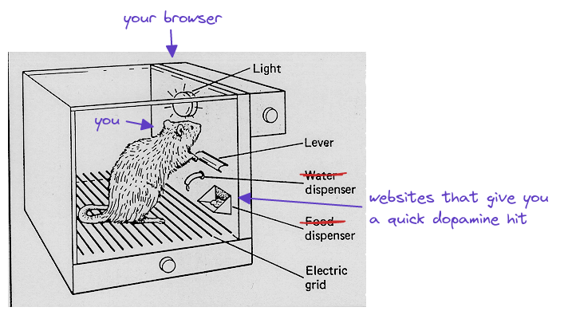

### Installation Instructions
**Google Chrome / Microsoft Edge / Brave** (Custom sites supported)
1. Download this repo as a [ZIP file from GitHub](https://github.com/spirobel/cloak/archive/refs/heads/master.zip).
1. Unzip the file and you should have a folder named `bypass-paywalls-chrome-master`.
1. In Chrome/Edge go to the extensions page (`chrome://extensions` or `edge://extensions`).
1. Enable Developer Mode.
1. Drag the `cloak` folder anywhere on the page to import it (do not delete the folder afterwards).

### this extension disables and deletes your search history

the goal behind this is to break the feedback loop between you and sites you visit often. (that give you a quick dopamine hit)

[more information](https://twitter.com/spirobel/status/1504012335370813443)

